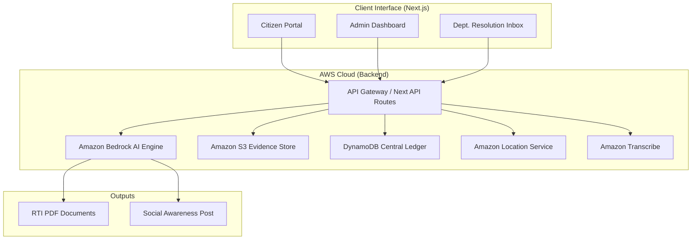

# Design Document: CivicSentinel

## Overview

CivicSentinel is a full-stack, serverless platform that leverages AWS Generative AI to automate the entire lifecycle of a civic grievance. The architecture is designed to handle high-concurrency reporting while providing deep analytical insights for municipal administrators. By utilizing **Amazon Bedrock (Claude 3.5 Sonnet)**, the system shifts from a simple database of complaints to an active "Sentinel" that drafts legal reports, verifies physical repairs via computer vision, and manages complex state transitions between citizens, admins, and department officials.

## Architecture

### High-Level System Architecture



### Core Technologies
- **Frontend**: Next.js 15 (App Router), Tailwind CSS, Lucide React (Monochromatic UI).
- **Compute**: AWS Lambda (via Next.js API routes).
- **Database**: Amazon DynamoDB (Single-table design for optimized grievance tracking).
- **Storage**: Amazon S3 (Encrypted storage for citizen evidence).
- **AI Agent**: Amazon Bedrock (Claude 3.5 Sonnet) for natural language processing and vision.
- **Geospatial**: Amazon Location Service for precise municipal ward mapping.

## Components and Interfaces

### 1. AI Drafting Agent
**Function**: Processes raw photos and voice notes to create formal complaints.
- **Logic**: Uses multimodal prompting to extract issue categories, assess severity, and cite specific municipal laws.
- **Tools**: Integrated with **Tavily Search** for real-time SLA research and **Amazon Location** for reverse-geocoding.

### 2. Vision Auditor Engine
**Function**: Mathematical verification of municipal repairs.
- **Logic**: Performs a side-by-side analysis of "Before" and "After" photos.
- **Output**: Returns a `verified` boolean, a `confidence` score (0-100), and a technical `reasoning` string explaining why the repair passed or failed the audit.

### 3. Smart State Machine
**Function**: Manages the "Sentinel Loop" through strictly defined statuses.
- **States**: `OPEN` → `ASSIGNED` → `FIXED` (Post-Audit) → `VERIFIED` → `RESOLVED` → `CLOSED`.
- **Logic**: Ensures a "Human-in-the-loop" approach where an Admin must approve the AI's audit, and a Citizen must provide the final confirmation.

### 4. Legal Escalation Layer
**Function**: Generates actionable legal artifacts.
- **RTI Integration**: Uses `pdf-lib` to programmatically inject AI-generated questions into official RTI templates.
- **Social Integration**: Dynamically drafts context-aware X (Twitter) posts based on the specific details of the grievance and its delay.

## Data Models

### Central Grievance Object (`CivicIssue`)
```typescript
interface CivicIssue {
  id: string;               // Unique Display ID (e.g., CIV-21D48F3E)
  rawId: string;            // DynamoDB UUID
  title: string;            // AI-Generated professional title
  status: Status;           // Uppercase State Machine status
  priority: Priority;       // LOW | MEDIUM | HIGH | CRITICAL
  reportedAt: number;       // Timestamp
  deadline: number;         // ReportedAt + 48h (Legal SLA)
  location: {
    lat: number;
    lng: number;
    landmark: string;
    area: string;           // Municipal Ward
    city: string;
  };
  evidenceKeys: string[];   // S3 keys for initial photos
  fixedImageKeys: string[]; // S3 keys for repair photos
  aiVerificationResult: {
    verified: boolean;
    confidence: number;
    reasoning: string;      // AI assessment of quality
  };
  history: HistoryEvent[];  // Audit trail of every system action
}
```

## Correctness Properties

The following properties ensure system reliability across all personas:

### Property 1: SLA Countdown Integrity
*For any* grievance, the `Doomsday_Clock` must stop ticking if the status moves to `RESOLVED` or `CLOSED`, preventing false "SLA Breached" alerts after an issue is addressed.

### Property 2: Spatial Routing Accuracy
*For any* GPS coordinate input, the system must use **Amazon Location Service** to identify the municipal ward before allowing an Admin to assign it to a departmental branch.

### Property 3: Evidence Immutability
*For any* uploaded evidence, the system must store files in S3 with unique timestamped keys, ensuring that "Before" photos cannot be overwritten by "After" photos.

### Property 4: Dual-Factor Closure
The system must prevent a grievance from moving to the `CLOSED` state unless a citizen explicitly confirms the resolution, ensuring the department cannot unilaterally close tickets.

### Property 5: Audit Transparency
The `aiVerificationResult` (reasoning and confidence) must be visible to both the Admin (for approval) and the Citizen (for transparency), ensuring the AI's "opinion" is part of the public record.

## Monitoring and Performance

- **Observability**: Structured JSON logging in CloudWatch for all AI Agent tool-use events.
- **Security**: Presigned URLs for all S3 media access, ensuring no public exposure of citizen photos.
- **Efficiency**: Cold-start optimization by keeping API routes minimal and using `requestAnimationFrame` for high-frequency UI spatial tracking during the demo tour.
